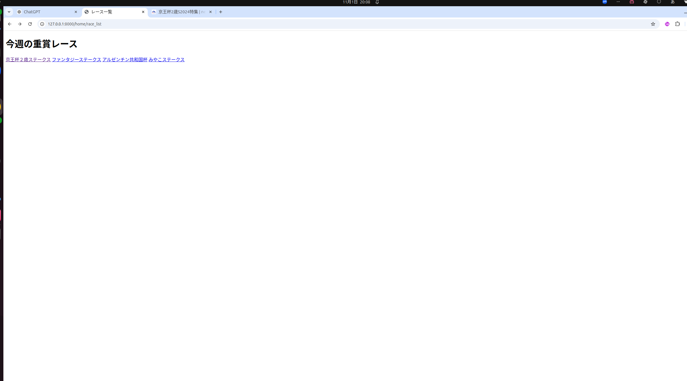
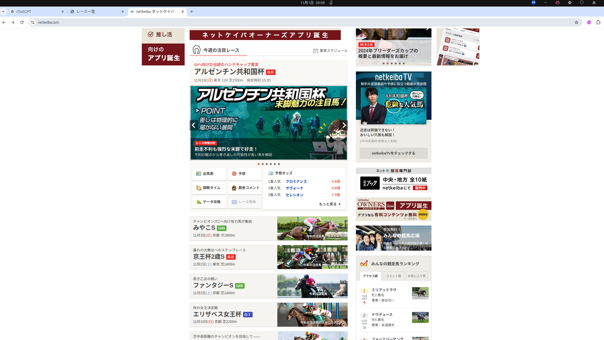
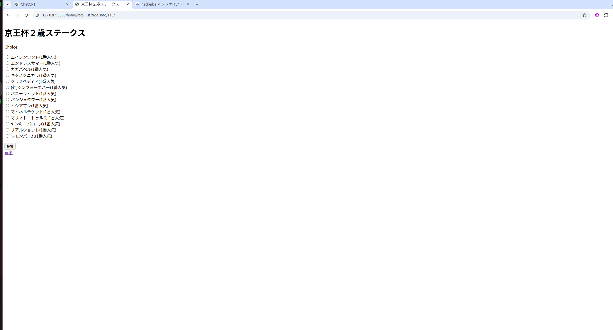
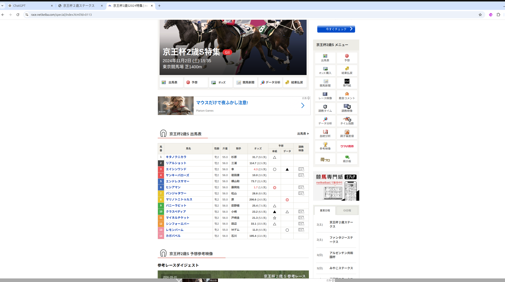
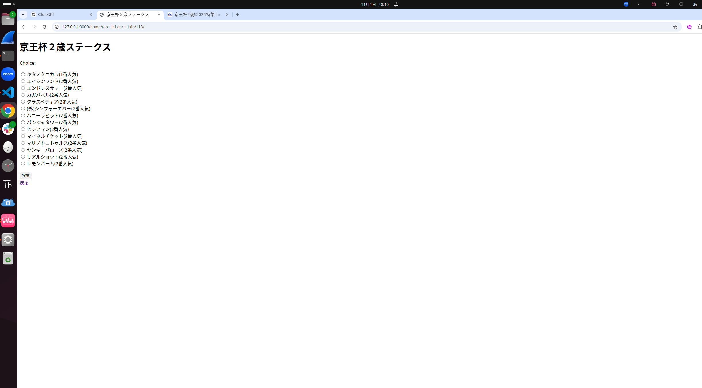

Webアプリの仕組みに興味があったので簡単なものを作りました。（随時更新）
 
一週間以内に開催される重賞レースの勝ち馬投票ができるアプリです。レース情報をスクレイピングし、データベースで管理しています。
 
使い方
 
一週間以内に開催される重賞レースが表示される

 

 
レース名をクリックすると出走馬一覧へ
 

 

 
投票すると人気順に並び変わる。（ここではキタノクニカラに１票）
 

